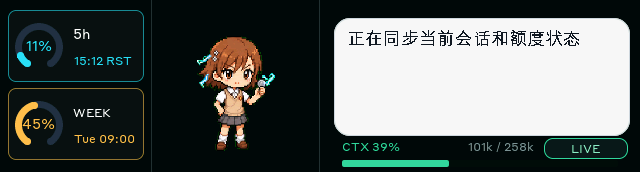
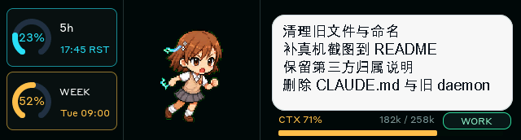
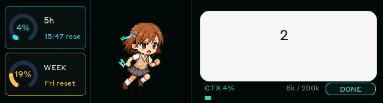
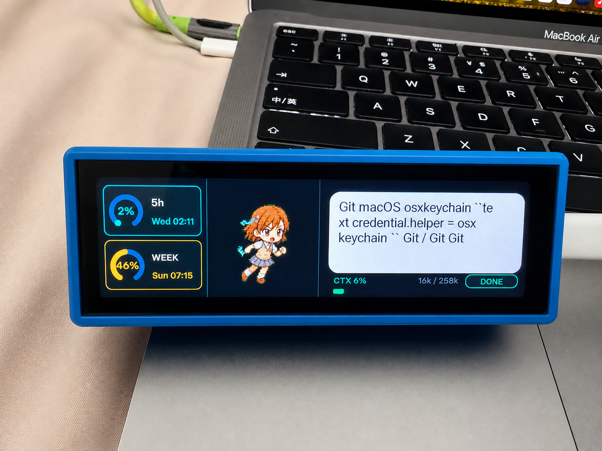
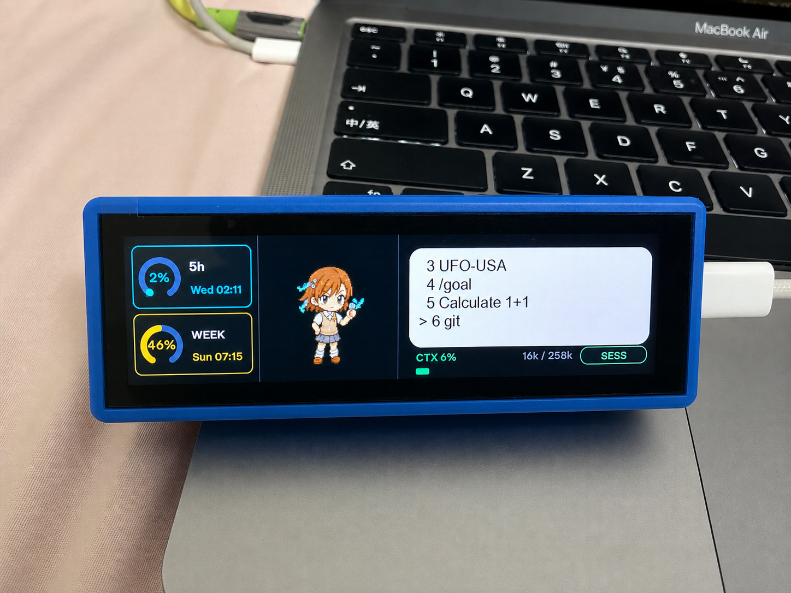
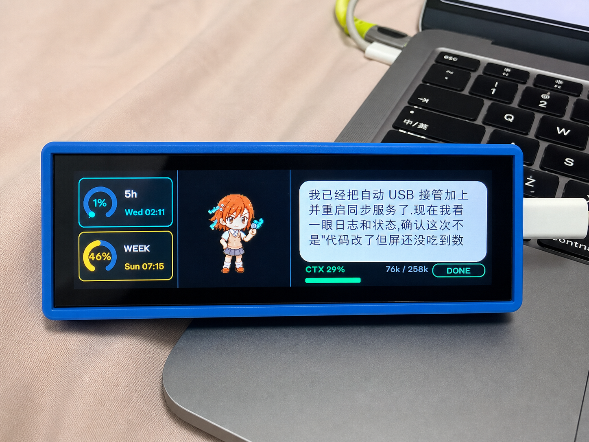

# CodexMeter

[简体中文](README.md) | [Third-Party Notes](THIRD_PARTY_NOTICES.md)

CodexMeter is an ESP32-S3 companion display for Codex Desktop. It runs on the
Waveshare ESP32-S3-Touch-LCD-3.49 and keeps the most useful live session data
visible on a dedicated screen: quota usage, reset times, recent Codex output,
context window progress, pet state, and recent session switching.

> The host-side daemon now supports both `Windows` and `macOS`. On Windows it
> supports BLE sync, automatic USB serial-port detection, pet asset updates,
> the local control page, and screenshot capture.

## Screenshots

| Live sync | Long reply | Short reply |
| --- | --- | --- |
|  |  |  |

## Real Photos

| Desk setup | Session list | Chinese output |
| --- | --- | --- |
|  |  |  |

## Current Feature Set

### 1. Codex quota display

- Exact 5-hour quota percentage
- Exact weekly quota percentage
- Reset timestamps for both quota windows
- On-device manual quota refresh
- Visual refresh feedback while a refresh is pending or just completed

### 2. Codex output mirroring

- Reads the latest assistant output from the active session
- Wraps the text for the device layout and renders it in the right-side bubble
- Uses a larger centered layout for very short replies
- Uses multiline layout for longer replies
- Supports vertical scrolling in the message area for overflow content
- Shows sync state labels such as `SYNC`, `DONE`, `INPUT`, and `ERROR`

### 3. Context window progress

- Reads the current Codex input token count
- Reads the active model context window size
- Shows exact `used / total` values
- Displays a progress bar for context usage
- Applies normal / warning / alert colors based on usage level

### 4. Pet sync and animation

- Automatically reads the currently selected Codex pet
- Loads `pet.json` and `spritesheet.webp` from the local pet directory
- Pushes a new pet atlas over USB the first time that pet is selected
- Switches animation state over BLE or serial after the atlas is cached
- Supports idle / running / waiting / review / failed device states
- Restores the last written pet atlas from device-side cache after reboot

### 5. Recent session switching

- Reads the recent session list
- Displays up to 8 recent sessions on the device
- Tapping the message area toggles between output view and session list
- Vertical swipes move the selection inside the session list
- Tapping again confirms the selected session
- A short BOOT press jumps directly to the next recent session
- A long BOOT press of about 1.2 seconds opens the recent session list directly

### 6. Device integration and debugging

- Custom BLE GATT service for live sync
- USB serial for flashing, screenshots, pet atlas updates, and diagnostics
- When BLE is unavailable but USB is connected, the daemon automatically falls back to live serial mirroring
- Quota refresh, BOOT-driven session switching, and session-list requests also travel back to the host over USB when directly connected
- Framebuffer screenshot export
- Local control page for daemon status and logs

## Interaction Model

### Touch gestures

| Area | Behavior |
| --- | --- |
| Left quota cards | Request a quota refresh |
| Middle pet area | Tap once to start running, tap again to return to idle |
| Right message area | Tap to open the recent session list; tap again to confirm selection |
| Right message area swipe | Scroll reply text, or move selection when the session list is open |

### Physical buttons

| Input | Behavior |
| --- | --- |
| BOOT short press | Jump to the next recent session |
| BOOT long press for about 1.2 seconds | Open the recent session list |
| PWR long press for about 3 seconds | Shut the board down |

### Pet sync rules

1. The daemon watches the currently selected Codex pet.
2. If the device does not have that pet atlas yet, it asks for a USB update.
3. Once USB is connected, the daemon writes the current pet atlas into device cache.
4. After that, normal runtime updates only need animation-selection commands.

### USB fallback sync rules

1. BLE remains the preferred path for normal live runtime sync.
2. If BLE is temporarily unavailable but USB is still attached, the daemon automatically switches to live serial mirroring.
3. In live serial mode, device-side actions such as quota refresh, recent-session switching, and session-list requests are also sent back to the host.
4. Once BLE is available again, normal live traffic can continue over BLE.

## How It Works

### Host daemon

`daemon/codexmeter_daemon.py` is responsible for:

- calling `codex app-server` for account and quota data
- reading Codex local state for recent and selected threads
- extracting recent assistant output and status from rollout logs
- loading the currently selected pet directory
- building compact payloads for quota, output, context, sessions, and pet state
- sending those payloads over BLE first, with live USB serial mirroring and event return paths available when the board is wired

### Device firmware

`firmware/src/main.cpp` is responsible for:

- rendering the 640x172 three-column interface
- handling touch input and BOOT / PWR interactions
- parsing JSON payloads
- caching pet atlas / animation data locally
- driving pet animation and UI updates on-device

### Transport split

- **BLE**: normal live sync for quota, output, context, session list, and state updates
- **USB serial**: flashing, screenshots, pet atlas updates, live fallback mirroring when BLE is unavailable, and device event return traffic

## Hardware

- Board: Waveshare ESP32-S3-Touch-LCD-3.49
- Logical UI layout: 640 x 172 landscape strip
- Native panel orientation: 172 x 640, mapped in firmware for landscape rendering
- Input: capacitive touch
- Power and shutdown: onboard PMU handling

## Quick Start

### 1. Install host dependencies

```bash
python3 -m pip install -r daemon/requirements.txt
```

### 2. Build firmware

```bash
pio run -d firmware -e waveshare_lcd_349
```

### 3. Flash over USB

macOS / Linux:

```bash
./flash.sh /dev/cu.usbmodem1101
```

Windows:

```powershell
.\flash-windows.ps1 -Port COM3
```

When `-Port` is omitted, PlatformIO selects the upload port automatically.

### 4. Start the daemon

macOS / Linux:

```bash
python3 daemon/codexmeter_daemon.py \
  --watch \
  --ble \
  --sync-pet-sprite \
  --cwd "$PWD"
```

Windows:

```powershell
.\run-windows.ps1 -InstallDeps
```

The Windows runner enables BLE and auto-selects the USB serial port by default.
To pin a specific port:

```powershell
.\run-windows.ps1 -SerialPort COM3
```

### 5. Install the macOS background service

```bash
./install.sh
```

## Useful Commands

### Screenshot capture

macOS / Linux:

```bash
./screenshot.sh screenshots/capture.png /dev/cu.usbmodem1101
```

Windows:

```powershell
.\screenshot-windows.ps1 -Output screenshots\capture.png -Port COM3
```

When `-Port` is omitted, the tool auto-selects the highest-priority USB serial port.

### Control page

Default control page:

```text
http://127.0.0.1:3490/
```

The control page exposes:

- current daemon mode
- recent sync status
- active serial port
- current pet
- recent error state
- daemon logs

## Important Parameters

### Daemon flags

- `--serial-port /dev/cu.usbmodem1101`
- `--auto-serial-port "/dev/cu.usbmodem*"`; on Windows the default is `auto`, and `COM3` or `COM*` can also be used
- `--serial-baud 921600`
- `--control-port 3490`
- `--pet-dir PATH`
- `--pet-anim-frames codex`
- `--sync-pet-sprite`
- `--ble`
- `--watch`

### BLE service

| Channel | UUID | Direction |
| --- | --- | --- |
| Service | `6f1c0001-7f7d-4a2b-9b7a-3490c0d3e001` | service |
| RX | `6f1c0002-7f7d-4a2b-9b7a-3490c0d3e001` | host writes to device |
| TX | `6f1c0003-7f7d-4a2b-9b7a-3490c0d3e001` | device ack / nack notify |
| REQ | `6f1c0004-7f7d-4a2b-9b7a-3490c0d3e001` | device requests refresh from host |

Current advertised name:

```text
CodexMeter
```

## Repository Layout
| Path | Purpose |
| --- | --- |
| `firmware/` | PlatformIO firmware project |
| `firmware/src/main.cpp` | main device UI, touch, serial protocol, and pet cache |
| `firmware/src/ble.*` | BLE sync service |
| `daemon/codexmeter_daemon.py` | host-side sync daemon |
| `screenshots/` | device screenshots used in the docs |
| `flash.sh` | serial flashing helper |
| `flash-windows.ps1` | Windows serial flashing helper |
| `install.sh` | macOS LaunchAgent installer |
| `screenshot.sh` | framebuffer screenshot helper |
| `screenshot-windows.ps1` | Windows framebuffer screenshot helper |
| `run-windows.ps1` | Windows foreground daemon runner |

## Credits and Attribution

### Pet artwork

The pet artwork used in the current live demo comes from:

- Name: `Mikoto`
- Author: `@legeling`
- Type: anime character

Install command:

```bash
curl -fsSL https://raw.githubusercontent.com/legeling/awesome-codex-pet/main/scripts/install-pet.sh | bash -s -- mikoto--lingxiaotian
```

### Project inspiration

The original device-companion idea behind CodexMeter was inspired by:

- [HermannBjorgvin/Clawdmeter](https://github.com/HermannBjorgvin/Clawdmeter)

## Project Status

This is a daily-usable personal hardware project build focused on:

- at-a-glance readability on the device
- accurate quota and output sync
- pet switching with local device cache
- efficient session switching on a small display

Natural next steps, if the project keeps growing, would be:

- fuller Bluetooth onboarding and pairing flows
- more device-side views
- richer pet state mapping
- deeper diagnostic screens
